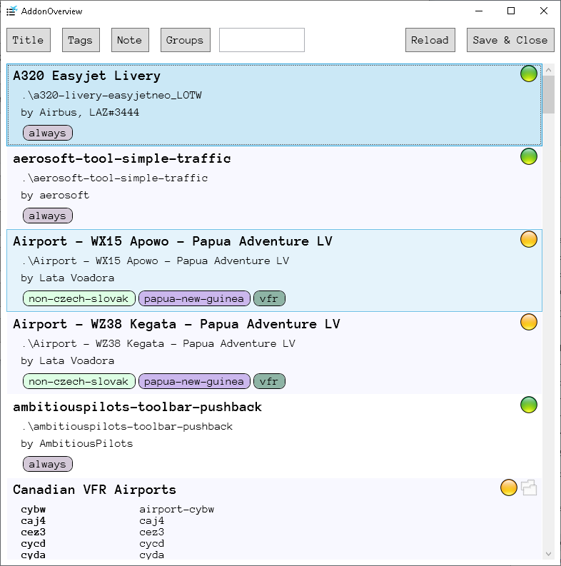
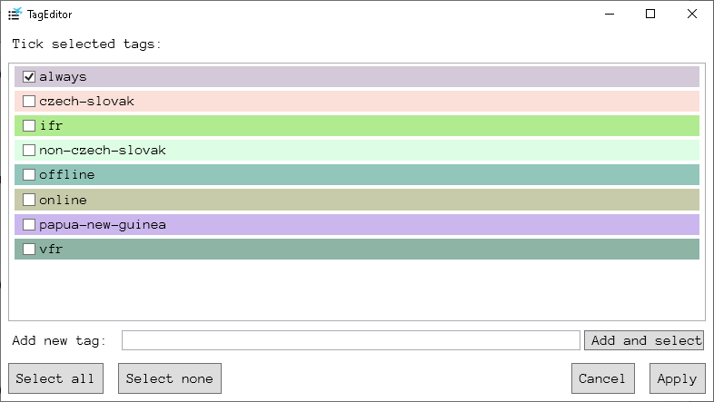
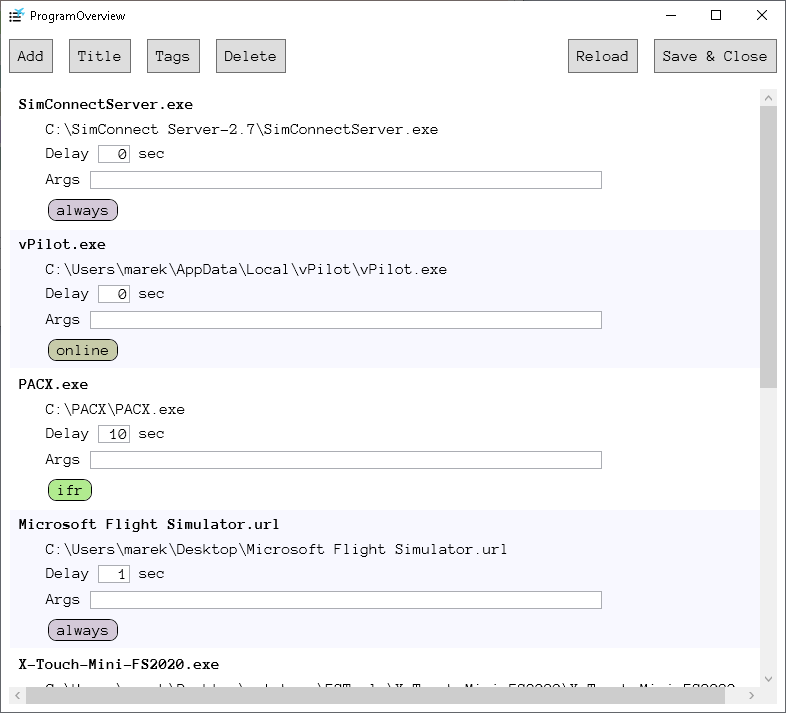
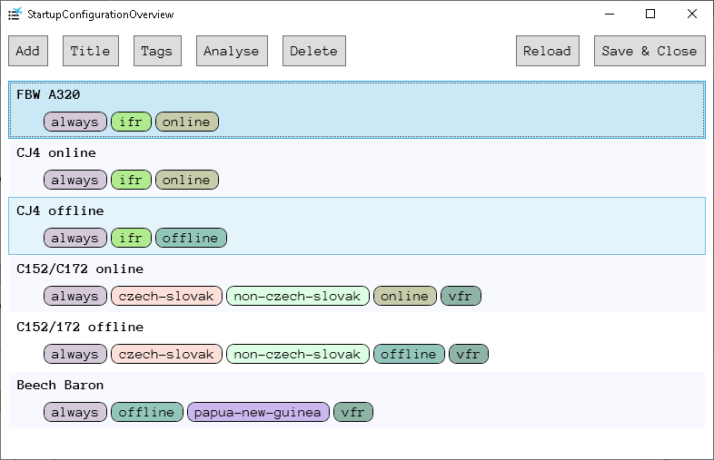

FS2020 Community Manager Solution
===

FS2020 Community Manager Solution (FSCMS) is a community addon and program manager. It allows to mark installed addons with tags and then create FS2020 launch configurations, which will define tags included in the execution. Maín properties:
* Automatically analyses for installed addons
* User can add custom programs launched together with FS2020.
* All items (addons/programs) are marked with text tags.
* User creates a startup configuration and selects included tags.
* Once executed, only addons with selected startup configration tags are included. Also, only programs with appropriate tags are executed.

# Installation

1. (.NET 6.0 installed)
2. Download the current version of the tool from the [Releases](https://github.com/Engin1980/FS2020CommunityFolderManager/releases) page.
3. Unzip the archive into the preferred location. Note that the application writes into its data folder, and therefore it must be placed at the location with sufficient access rights.

# Basic Usage

Once started the application contains the main empty screen with several buttons.

## 1. Initial set-up

Note that steps in this section must be done only for the first time when the application is started. Then the configuration is stored into a file.

1. Select `Settings & Credits`.
2. Adjust `FS2020 Community Folder` using the button on the right. Choose the appropriate community folder location. To locate your community folder, use web tutorials, e.g., [this one](https://helpdesk.aerosoft.com/hc/en-gb/articles/5023507568925-How-to-locate-the-Community-folder-in-Microsoft-Flight-Simulator).
3. Save the window using `Save & Close`.

## 2. Scan and addon management

On the main window, select `Addon Management`.

First ability of the application is the addon management. FSCMS automatically detects all the addons in the `Community` folder. By adding tags, an user can select which addons will be activated when FS2020 is launched.

The addonds visible in this window are detected automatically w.r.t. entered community folder. If you do not see any addons, re-check your community folder selection.

Then, for every addon, you should select one or more tags. To set tag:

1. Select the appropriate addon in the list.
2. Press the `Tags` button (see below). Select/add the appropriate tags and confirm.
3. Once closed, the addon overview window should show the selected addon with marked labels.

Again, all changes here are saved (and the window is closed) using the `Save & Close` button.

## 3. Selection of co-launched programs

On the main window, select `Program Management`.

Second ability of the application is to start any program when the startup configuration is selected. By default, FSCMS does not start any program (even FS2020) when the configuration is launched. You must add all the required programs on your own.

To add a program:

1. Press `Add` button.
2. Select the appropriate program in the dialog. Default supported file extensions are exe, bat, url and lnk, but you can choose any file which can be executed by shell on your computer. Then confirm the selection. The selected program will appear in the list.
3. Select the program in the list and press the `Tags` button to assign tags. In the opened window, select/add any appropriate tags and confirm the dialog.
4. Repeat steps 2. and 3. while neccessary.
5. Save the changes and close the window using `Save & Close` button.

## 4. Creation of a startup configuration

Startup configuration is a defition telling which addons should be de/activated  and which programs should be executed when the configuration is launched. Each configuration has assignable tags. The rule is that when the configuration is launched:
* all addons with any tag included in the configuration's tags will be set as active (and available in FS2020),
* all addons with any tags in the configration's tags will be deactivated (and not available in FS2020),
* all programs with any tag included in the configuration's tags will be executed.

To add a startup configuration:

1. Press `Add` button, enter the configuration name and confirm. The configuration will appear in the list.
2. Select the configuration in the list and press `Tags` button to adjust tags. 
3. (Optional) To see which addons will be activated and which programs will be launched, use `Analyse` button.
4. Save the changes and close the window using `Save & Close` button.

## 5. Launching a configuration

All created configurations will appear as big buttons on the main application page. To launch the configuration, simply press the configuration button.

# Additional features

What else you can do?

For addons:
* You can group addons together into groups. Then you can assign a tag/tags to the whole group.
* You can rename the addon. The name is reflected in the FSCMS only. This tool servers only for you to better understand what exactly the addon is.
* You can set/remove tags for multiple addons at once. Just select more of them in the list (use Ctrl+click) before pressing `Tags` button.

For programs:
* You can choose startup delay for every program/file. The delay is in seconds and is always evaluated w.r.t. the configuration start time.
* You can set startup command line arguments if necessary.
* You can set/remove tags for multiple programs at once. Just select more of them in the list (use Ctrl+click) before pressing `Tags` button.

# Frequently Asked Questions

Q: *What happens to deactivated addons?*

A: Deactivated addons are moved into `{Community}\_inactive` folder. In the case that anything fails, just move the content from `{Community}\_inactive` into `{Community}` and you will be in the state before the first execution of FSCMS.

# Problems and issues

If you find a bug or want to report any issue or idea, feel free to use [Issues](https://github.com/Engin1980/FS2020CommunityFolderManager/issues) page. Please provide as much information as possible.

# License
The FSCMS is released under MIT license. See License file.
