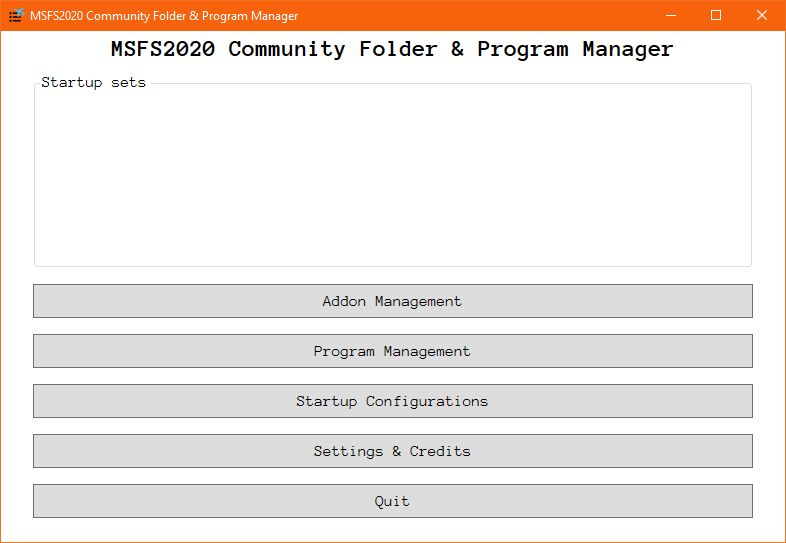

# FS2020 Community Manager Solution
FS2020 Community Manager Solution (FSCMS) is a community addon and program manager. It allows to mark installed addons with tags and then create FS2020 launch configurations, which will define tags included in the execution. Maín properties:
* Automatically anylyses for installed addons
* User can add custom programs launched together with FS2020.
* All items (addons/programs) are marked with text tags
* User creates a startup configuration and selects included tags.
* Once executed, only addons with selected startup configration tags are included. Also, only programs with appropriate tags are executed.

## Installation

1. (.NET 6.0 installed)
2. Download the current version of the tool from the [Releases](https://github.com/Engin1980/FS2020CommunityFolderManager/releases) page.
3. Unzip the archive into the preferred location. Note that the application writes into its data folder, and therefore it must be placed at the location with sufficient access rights.

## Usage

Once started the application contains the main empty screen with several buttons.

### 1. Initial set-up

1. Select `Settings & Credits`.
2. Adjust `FS2020 Community Folder` using the button on the right.
3. Save the window using `Save & Close`.

### 2. Scan and addon management

### 3. Selection of co-launched programs

### 4. Creation of a startup configuration

### 5. Launching a configuration